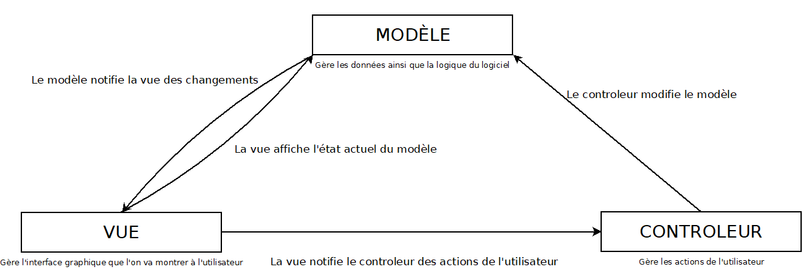
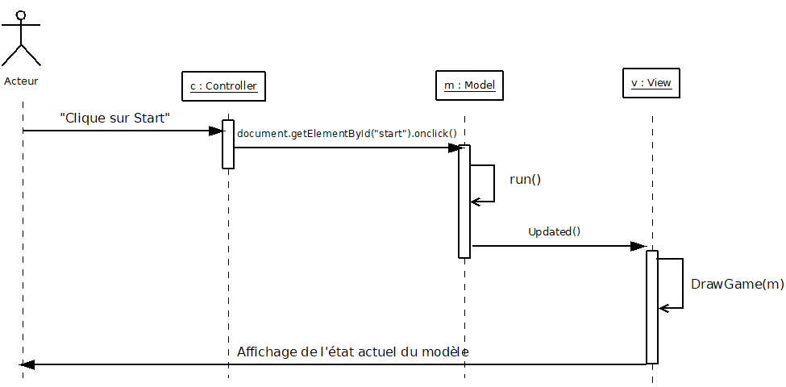

# ISI3 - MVP design pattern - "Game of Life"

> Le rapport est à fournir dans ce document sous chacune des questions. 
> **Ne restez pas bloqués bêtement, demander de l'aide**
> Ne copier pas le code de votre voisin, ça se voit.

Nom/Prénom: Techer Christophe

Lien du codesandbox: https://codesandbox.io/s/github/PolytechLyon/2020-isi3-mvc-TecherChristophe

> Pour générer un codesandbox associé à votre code, [suiver cette doc](https://codesandbox.io/docs/importing#import-from-github)

## Game of Life

Le jeu de la vie est un automate cellulaire qui répond à des règles très simple.
Il est inventé par [John Horton Conway](https://fr.wikipedia.org/wiki/John_Horton_Conway)(1937-2020).

## Avant-propos

1. Expliquer le design pattern MVC à l'aide d'un schéma à insérer directement ici. 
Utiliser un outils commde Dia pour le représenter. Je veux **votre** schéma, pas un de ceux qu'on peut trouver sur le net.

**Note : Le controlleur ne modifie pas directement le modèle mais induit son changement en appelant ces méthodes**

2. Expliquer ce pattern à l'aide en complétant ce texte.

Le pattern MVP, vise à découper le modèle de la vue et du controleur afin de rendre le code plus claire.
Les responsabilités ne sont alors plus partagées.
On peut ainsi par exemple changer l'aspect visuel de son application sans pour autant impacter le code métier. Ceci facilite ainsi les changements dans le code une fois le pattern pris en main.

3. Expliquer dans quels cas on doit privilégier le pattern MVC.

Le pattern MVC est à privilégier pour les applications ayant une interface graphique à partir de laquelle l'utilisateur intéragit avec celle-ci. De plus, le découpage en trois partie de l'application permet de faciliter les mise à jour ainsi que les modficiations du code. Ce qui rend le pattern attrayant pour des applications qui sont voués à être modifié de manière régulière comme les applications WEB par exemple.

## A faire (obligatoire)

- Render le jeu fonctionel tout en respectant le design pattern MVC.
- Le bouton `start` doit lancer le jeu.
- Le bouton `stop` doit arrêter le jeu en l'état, le `start` relance le jeu.
- le bouton `reset` arrête le jeu et vide remet à la grille à l'état initiale.

### Observer Observable

Afin de mettre à jour la vue à chaque nouvelle génération du jeu, la fonction `updated` doit notifier la view afin qu'elle se mette à jour.
En quoi cela relève du design pattern ObserverObservable.

1. Expliquer votre implémentation:

L'usage d'une callback permet ici de faire une notification afin dire à la _View_ de se redessiner.
L'objet _Model_ n'a pas de lien avec _View_ pourtant grâce à la fonction Updated() il peut notifier la _View_.

2. Insérer ici un UML montrant le pattern Observer-Observable liés aux objects de ce TP.

J'ai choisi de faire un diagramme de séquence pour montrer comment le modèle (l'observable) notifie la vue (l'observer) au travers de sa fonction updated() et de son attribut callback. Le diagramme de classe n'étant pas pertinent puisqu'il n'existe pas de lien entre les deux classes.

## Optionel

> Si vous voulez apprendre d'autres choses

- Faire sorte de pouvoir changer les dimensions de la grille par in `<input/>` HTML.
- Faire en sorte de pouvoir modifier l'état d'une cellule en cliquant dessus.

## :warning: À rendre

- Une URL de codesandox pointant sur votre projet github afin que je puisse voir et tester le code.
- Le rapport complet.
